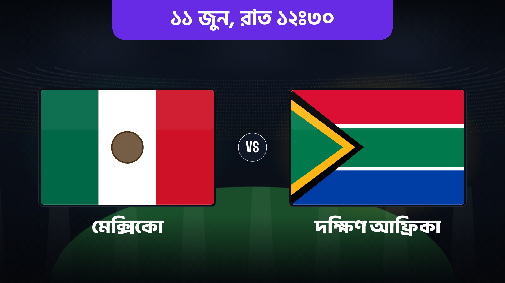
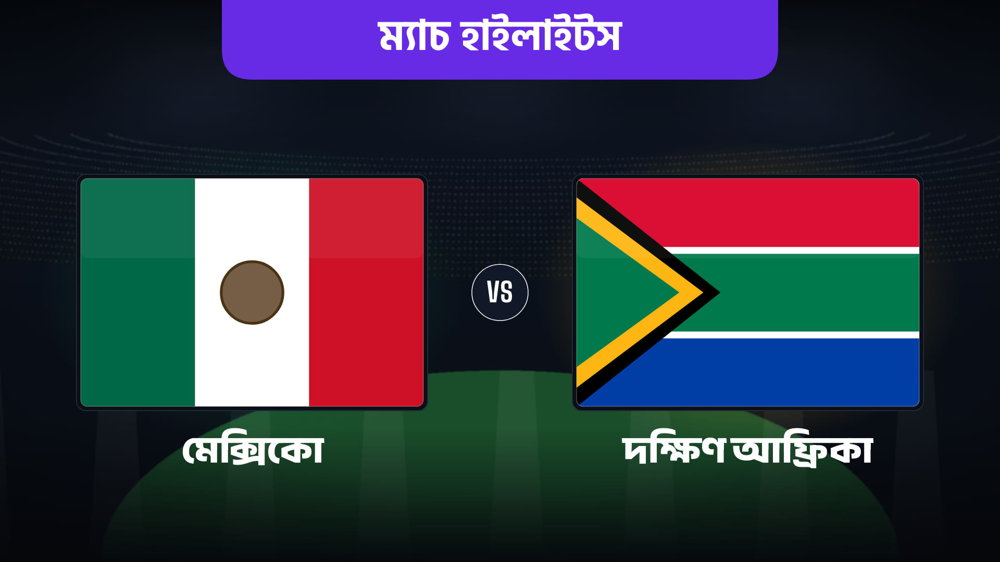

# WC26 Banner Engine ⚽🇧🇩

Generate **FIFA World Cup 2026 "team vs team" banners** in **Bengali** — 16:9 landscape
(1920×1080) and 2:3 portrait. Each match produces a **fixture** banner and a **highlights**
banner, complete with procedural flags, team accent glows, date/time, and stadium backgrounds.

<p align="center">
  
  
</p>

---

## 🚀 Use it online (easiest — nothing to install)

Open the web app and make banners right in your browser:

**👉 https://wc26-banner-engine.streamlit.app/**

1. Pick a match from the **sidebar** (Match Selector).
2. *(Optional)* upload your own background image, or tweak font sizes.
3. Click **▶ Preview** — four banners render (fixture + highlights, landscape + portrait).
4. Click **⬇ Download All (ZIP)** to grab all four as PNGs.

That's it. No setup, no command line.

> **Tip:** Preview one match at a time online. Generating all 72 matches at once is heavy —
> do that locally (see below).

---

## 💻 Run it on your own computer

### 1. Get the code
```bash
git clone https://github.com/haradhansarker-commits/wc26-banner-engine.git
cd wc26-banner-engine
```

### 2. One-time setup
```bash
bash setup.sh
```
This installs everything: the `rsvg-convert` rasterizer (via your OS package manager),
Python deps, the Bengali/Latin fonts, and the fallback stadium background.

> **macOS without Homebrew?** `setup.sh` can't auto-install the rasterizer.
> The engine then falls back to **Chromium/Playwright** automatically — run
> `pip install playwright && playwright install chromium` once and it just works.

### 3. Launch the visual editor
```bash
streamlit run app.py
```
Opens the same UI as the web app in your browser at `http://localhost:8501`.

### 4. Or batch-generate every fixture
```bash
python3 batch.py            # reads fixtures.json → out/
```
Produces 4 images per match in `out/` (landscape + portrait × fixture + highlights).

---

## ✏️ Customize

### Add or edit matches
Edit **`fixtures.json`** — a list of match objects:
```jsonc
{
  "a_code": "MEX", "a_name": "মেক্সিকো",        // left team  (code → flag + glow color)
  "b_code": "RSA", "b_name": "দক্ষিণ আফ্রিকা",   // right team
  "mode": "fixture",                           // "fixture" or "highlights"
  "stage": "গ্রুপ এ — উদ্বোধনী ম্যাচ",            // small line under the title
  "line1": "১১ জুন ২০২৬",                        // date (Bengali numerals)
  "line2": "রাত ১২ঃ৩০",                          // time
  "venue_img": "azteca.png"                     // optional photo in venues/
}
```
> Convert English digits to Bengali: `0123456789` → `০১২৩৪৫৬৭৮৯`.

### Use a real stadium photo
Drop a landscape image into **`venues/`** and set `"venue_img": "<filename>"` on the match.
Bigger than 1920×1080 is fine — it's cropped to fill. No photo? A procedural stadium is used.

### Add a new team
In **`wc26_template.py`**: add an accent color `ACCENT["XXX"] = "#color"`, write a
`flag_xxx()` function, then register it with `FLAGS["XXX"] = flag_xxx`.
Flags draw inside a `0..100 × 0..66.667` box. (See `GENERATION_GUIDE.md` for details.)

---

## 📁 What each file is

| File | Purpose |
|---|---|
| `app.py` | The web/visual editor (Streamlit). |
| `wc26_template.py` | The engine — design, flags, `render()` / `render_portrait()`. |
| `batch.py` | Generates every match in `fixtures.json` into `out/`. |
| `fixtures.json` | Your match data. |
| `venues/` | Optional real stadium photos. |
| `fonts/` | Embedded Bengali + Latin fonts (required). |
| `setup.sh` | One-shot installer. |
| `GENERATION_GUIDE.md` | Deep-dive guide. |

---

## ❓ Troubleshooting

| Problem | Fix |
|---|---|
| **Bengali text missing / boxes (□□□)** | The rasterizer can't see the fonts. Locally, rerun `bash setup.sh`. The cloud build renders via Chromium so fonts embed correctly. |
| **`rsvg-convert: command not found`** | Install librsvg (`brew install librsvg` / `apt install librsvg2-bin`), or use the Chromium fallback (`pip install playwright && playwright install chromium`). |
| **Fonts look wrong online (thin/incorrect weight)** | The app forces Chromium rendering (`WC26_RENDERER=playwright`) to match local output exactly. Reboot the app from "Manage app" if you just deployed. |
| **App slow / crashes generating all matches** | The free hosting tier has limited memory — preview one match online, batch the full set locally with `python3 batch.py`. |

---

## 🌐 Deploy your own copy

This repo is ready for **[Streamlit Community Cloud](https://share.streamlit.io)** (free):

1. Push this repo to GitHub (public).
2. On share.streamlit.io → **New app** → pick the repo, branch `main`, main file `app.py`.
3. Deploy. `packages.txt` (system libs) and `requirements.txt` (Python deps) install
   automatically.

Other hosts that support system packages also work (Hugging Face Spaces, or Docker on
Render / Railway / Fly).

---

Made for World Cup 2026 — group stage through the final. ⚽
